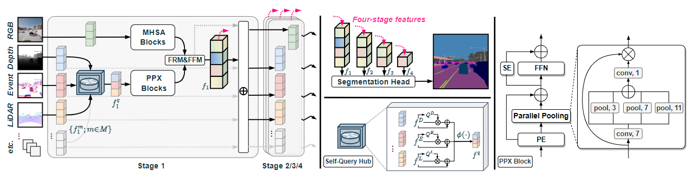

 

## Delivering Arbitrary-Modal Semantic Segmentation (CVPR 2023)

## Introduction

To conduct arbitrary-modal semantic segmentation, we create **DeLiVER** benchmark, covering **De**pth, **Li**DAR, multiple **V**iews, **E**vents, and **R**GB. It has four *severe weather conditions* as well as five *sensor failure cases* to exploit modal complementarity and resolve partial outages. Besides, we present the arbitrary cross-modal segmentation model **CMNeXt**, allowing to scale from 1 to 81 modalities on the DeLiVER, KITTI-360, MFNet, NYU Depth V2, UrbanLF, and MCubeS datasets.

## DeLiVER dataset

## CMNeXt model

## Usage

*Coming soon...*
