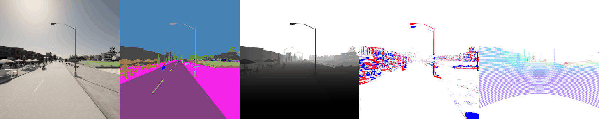
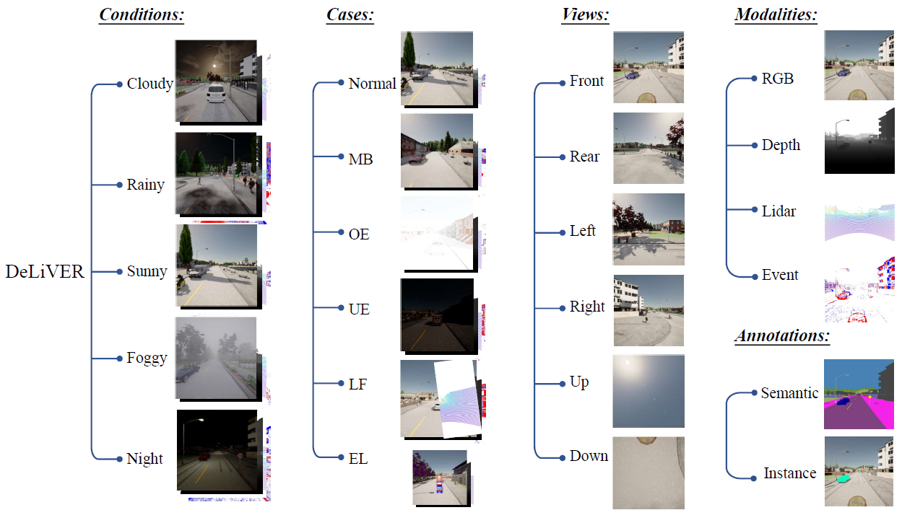
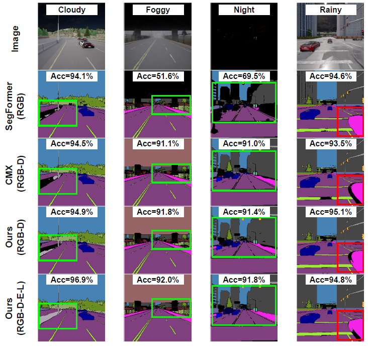

<div align="center"> 

## Delivering Arbitrary-Modal Semantic Segmentation (CVPR 2023)

</div>

<p align="center">
<a href="https://arxiv.org/pdf/2303.01480.pdf">
    </a>
<a href="https://jamycheung.github.io/DELIVER.html">
    </a>
<a href="https://www.youtube.com/watch?v=X-VeSLsEToA">
    </a>
<a href="https://pytorch.org/">
    </a>
<a href="https://github.com/jamycheung/DELIVER/blob/main/LICENSE">
    </a>
</p>

[](https://paperswithcode.com/sota/semantic-segmentation-on-deliver?p=delivering-arbitrary-modal-semantic)  
[](https://paperswithcode.com/sota/semantic-segmentation-on-kitti-360?p=delivering-arbitrary-modal-semantic)  
[](https://paperswithcode.com/sota/semantic-segmentation-on-nyu-depth-v2?p=delivering-arbitrary-modal-semantic)  
[](https://paperswithcode.com/sota/thermal-image-segmentation-on-mfn-dataset?p=delivering-arbitrary-modal-semantic)  
[](https://paperswithcode.com/sota/semantic-segmentation-on-mcubes?p=delivering-arbitrary-modal-semantic)  
[](https://paperswithcode.com/sota/semantic-segmentation-on-urbanlf?p=delivering-arbitrary-modal-semantic)  
[](https://paperswithcode.com/sota/thermal-image-segmentation-on-noisy-rs-rgb-t?p=delivering-arbitrary-modal-semantic)

## Introduction

To conduct arbitrary-modal semantic segmentation, we create **DeLiVER** benchmark, covering **De**pth, **Li**DAR, multiple **V**iews, **E**vents, and **R**GB. It has four *severe weather conditions* as well as five *sensor failure cases* to exploit modal complementarity and resolve partial outages. Besides, we present the arbitrary cross-modal segmentation model **CMNeXt**, allowing to scale from 1 to 81 modalities on the DeLiVER, KITTI-360, MFNet, NYU Depth V2, UrbanLF, and MCubeS datasets.

For more details, please check our [arXiv](https://arxiv.org/pdf/2303.01480.pdf) paper.

## Updates
- [x] 03/2023, init repository.
- [x] 04/2023, release front-view DeLiVER. Download from [**GoogleDrive**](https://drive.google.com/file/d/1P-glCmr-iFSYrzCfNawgVI9qKWfP94pm/view?usp=share_link).
- [x] 04/2023, release CMNeXt model weights. Download from [**GoogleDrive**](https://drive.google.com/drive/folders/1MZaaZ5_rEVSjns3TBM0UDt6IW4X-HPIN?usp=share_link).

## DeLiVER dataset




DeLiVER multimodal dataset including (a) four adverse conditions out of five conditions(**cloudy, foggy, night-time, rainy and sunny**). Apart from normal cases, each condition has five corner cases (**MB: Motion Blur; OE: Over-Exposure; UE: Under-Exposure; LJ: LiDAR-Jitter; and EL: Event Low-resolution**). Each sample has six views. Each view has four modalities and two labels (semantic and instance). (b) is the data statistics. (c) is the data distribution of 25 semantic classes.


### DELIVER splitting



### Data folder structure
**Download DELIVER dataset from [**GoogleDrive**](https://drive.google.com/file/d/1P-glCmr-iFSYrzCfNawgVI9qKWfP94pm/view?usp=share_link) (~12.2 GB)**. 

The `data/DELIVER` folder is structured as:
```text
DELIVER
├── depth
│   ├── cloud
│   │   ├── test
│   │   │   ├── MAP_10_point102
│   │   │   │   ├── 045050_depth_front.png
│   │   │   │   ├── ...
│   │   ├── train
│   │   └── val
│   ├── fog
│   ├── night
│   ├── rain
│   └── sun
├── event
├── hha
├── img
├── lidar
└── semantic
```

## CMNeXt model


CMNeXt architecture in Hub2Fuse paradigm and asymmetric branches, having e.g., Multi-Head Self-Attention (MHSA) blocks in the RGB branch and our Parallel Pooling Mixer (PPX) blocks in the accompanying branch. At the hub step, the Self-Query Hub selects informative features from the supplementary modalities. At the fusion step, the feature rectification module (FRM) and feature fusion module (FFM) are used for feature fusion. Between stages, features of each modality are restored via adding the fused feature. The four-stage fused features are forwarded to the segmentation head for the final prediction.


## Environment

```bash
conda env create -f environment.yaml
conda activate cmnext
# Optional: install apex follow: https://github.com/NVIDIA/apex
```

## Data preparation
Prepare six datasets:
- [DELIVER](https://github.com/jamycheung/DELIVER), for RGB-Depth-Event-LiDAR semantic segmentation.
- [KITTI-360](https://www.cvlibs.net/datasets/kitti-360/), for RGB-Depth-Event-LiDAR semantic segmentation.
- [NYU Depth V2](https://cs.nyu.edu/~silberman/datasets/nyu_depth_v2.html), for RGB-Depth semantic segmentation.
- [MFNet](https://github.com/haqishen/MFNet-pytorch), for RGB-Thermal semantic segmentation.
- [UrbanLF](https://github.com/HAWKEYE-Group/UrbanLF), for light-filed segmentation based on sub-aperture images.
- [MCubeS](https://github.com/kyotovision-public/multimodal-material-segmentation), for multimodal material segmentation with RGB-A-D-N modalities.

Then, all datasets are structured as:

```
data/
├── DELIVER
│   ├── img
│   ├── hha
│   ├── event
│   ├── lidar
│   └── semantic
├── KITTI-360
│   ├── data_2d_raw
│   ├── data_2d_hha
│   ├── data_2d_event
│   ├── data_2d_lidar
│   └── data_2d_semantics
├── NYUDepthv2
│   ├── RGB
│   ├── HHA
│   └── Label
├── MFNet
│   ├── rgb
│   ├── ther
│   └── labels
├── UrbanLF
│   ├── Syn
│   └── real
├── MCubeS
│   ├── polL_color
│   ├── polL_aolp
│   ├── polL_dolp
│   ├── NIR_warped
│   └── SS
```

*For RGB-Depth, the [HHA format](https://github.com/charlesCXK/Depth2HHA-python) is generated from depth image.*

## Model Zoo

### DELIVER dataset 

| Model-Modal      | #Params(M) | GFLOPs | mIoU   | weight |
| :--------------- | :---------- | :----- | :----- | :------ |
| CMNeXt-RGB       | 25.79      | 38.93 | 57.20 | [GoogleDrive](https://drive.google.com/drive/folders/1OWteEOrjfrC3VNg3sxJFZPHz9urkZ3lm?usp=share_link) |
| CMNeXt-RGB-E     | 58.69      | 62.94 | 57.48 | [GoogleDrive](https://drive.google.com/drive/folders/1OWteEOrjfrC3VNg3sxJFZPHz9urkZ3lm?usp=share_link) |
| CMNeXt-RGB-L     | 58.69      | 62.94 | 58.04 | [GoogleDrive](https://drive.google.com/drive/folders/1OWteEOrjfrC3VNg3sxJFZPHz9urkZ3lm?usp=share_link) |
| CMNeXt-RGB-D     | 58.69      | 62.94 | 63.58 | [GoogleDrive](https://drive.google.com/drive/folders/1OWteEOrjfrC3VNg3sxJFZPHz9urkZ3lm?usp=share_link) |
| CMNeXt-RGB-D-E   | 58.72      | 64.19 | 64.44 | [GoogleDrive](https://drive.google.com/drive/folders/1OWteEOrjfrC3VNg3sxJFZPHz9urkZ3lm?usp=share_link) |
| CMNeXt-RGB-D-L   | 58.72      | 64.19 | 65.50 | [GoogleDrive](https://drive.google.com/drive/folders/1OWteEOrjfrC3VNg3sxJFZPHz9urkZ3lm?usp=share_link) |
| CMNeXt-RGB-D-E-L | 58.73      | 65.42 | 66.30 | [GoogleDrive](https://drive.google.com/drive/folders/1OWteEOrjfrC3VNg3sxJFZPHz9urkZ3lm?usp=share_link) |


### KITTI360 dataset

| Model-Modal      | mIoU   | weight |
| :--------------- | :----- | :------ |
| CMNeXt-RGB       | 67.04 | [GoogleDrive](https://drive.google.com/drive/folders/1OXfBNNcwMCQWGmvOqvkAHd8xViKJ6djf?usp=share_link) |
| CMNeXt-RGB-E     | 66.13 | [GoogleDrive](https://drive.google.com/drive/folders/1OXfBNNcwMCQWGmvOqvkAHd8xViKJ6djf?usp=share_link) |
| CMNeXt-RGB-L     | 65.26 | [GoogleDrive](https://drive.google.com/drive/folders/1OXfBNNcwMCQWGmvOqvkAHd8xViKJ6djf?usp=share_link) |
| CMNeXt-RGB-D     | 65.09 | [GoogleDrive](https://drive.google.com/drive/folders/1OXfBNNcwMCQWGmvOqvkAHd8xViKJ6djf?usp=share_link) |
| CMNeXt-RGB-D-E   | 67.73 | [GoogleDrive](https://drive.google.com/drive/folders/1OXfBNNcwMCQWGmvOqvkAHd8xViKJ6djf?usp=share_link) |
| CMNeXt-RGB-D-L   | 66.55 | [GoogleDrive](https://drive.google.com/drive/folders/1OXfBNNcwMCQWGmvOqvkAHd8xViKJ6djf?usp=share_link) |
| CMNeXt-RGB-D-E-L | 67.84 | [GoogleDrive](https://drive.google.com/drive/folders/1OXfBNNcwMCQWGmvOqvkAHd8xViKJ6djf?usp=share_link) |

### NYU Depth V2

| Model-Modal      | mIoU   | weight |
| :--------------- | :----- | :------ |
| CMNeXt-RGB-D (MiT-B4)     | 56.9 | [GoogleDrive](https://drive.google.com/drive/folders/1OXrMv1Mi6E-vyedlkNpfc5ibJeJDfwqq?usp=share_link) |
### MFNet

| Model-Modal      | mIoU   | weight |
| :--------------- | :----- | :------ |
| CMNeXt-RGB-D (MiT-B4)     | 59.9 | [GoogleDrive](https://drive.google.com/drive/folders/1OaOHMbD5P_HPwTzzXwdYRUFIiGkyFQfP?usp=share_link) |
### UrbanLF
There are **real** and **synthetic** datasets. 

| Model-Modal     | Real   | weight | Syn    | weight |
| :-------------- | :----- | :----- | :----- | :----- |
| CMNeXt-RGB      | 82.20 | [GoogleDrive](https://drive.google.com/drive/folders/1OfepYOYaM8I0itjuHK4csqmAuu_zHol-?usp=share_link) | 78.53 | [GoogleDrive](https://drive.google.com/drive/folders/1OfepYOYaM8I0itjuHK4csqmAuu_zHol-?usp=share_link) |
| CMNeXt-RGB-LF8  | 83.22 | [GoogleDrive](https://drive.google.com/drive/folders/1OfepYOYaM8I0itjuHK4csqmAuu_zHol-?usp=share_link) | 80.74 | [GoogleDrive](https://drive.google.com/drive/folders/1OfepYOYaM8I0itjuHK4csqmAuu_zHol-?usp=share_link) |
| CMNeXt-RGB-LF33 | 82.62 | [GoogleDrive](https://drive.google.com/drive/folders/1OfepYOYaM8I0itjuHK4csqmAuu_zHol-?usp=share_link) | 80.98 | [GoogleDrive](https://drive.google.com/drive/folders/1OfepYOYaM8I0itjuHK4csqmAuu_zHol-?usp=share_link) |
| CMNeXt-RGB-LF80 | 83.11 | [GoogleDrive](https://drive.google.com/drive/folders/1OfepYOYaM8I0itjuHK4csqmAuu_zHol-?usp=share_link) | 81.02 | [GoogleDrive](https://drive.google.com/drive/folders/1OfepYOYaM8I0itjuHK4csqmAuu_zHol-?usp=share_link) |

### MCubeS
| Model-Modal      | mIoU   | weight |
| :--------------- | :----- | :----- |
| CMNeXt-RGB       | 48.16 | [GoogleDrive](https://drive.google.com/drive/folders/1OgbqpT6TSCPPsoJn0sh2wfXNy5mL5nk9?usp=share_link) |
| CMNeXt-RGB-A     | 48.42 | [GoogleDrive](https://drive.google.com/drive/folders/1OgbqpT6TSCPPsoJn0sh2wfXNy5mL5nk9?usp=share_link) |
| CMNeXt-RGB-A-D   | 49.48 | [GoogleDrive](https://drive.google.com/drive/folders/1OgbqpT6TSCPPsoJn0sh2wfXNy5mL5nk9?usp=share_link) |
| CMNeXt-RGB-A-D-N | 51.54 | [GoogleDrive](https://drive.google.com/drive/folders/1OgbqpT6TSCPPsoJn0sh2wfXNy5mL5nk9?usp=share_link) |


## Training

Before training, please download [pre-trained SegFormer](https://drive.google.com/drive/folders/10XgSW8f7ghRs9fJ0dE-EV8G2E_guVsT5?usp=sharing), such as `checkpoints/pretrained/segformer/mit_b2.pth`.

```text
checkpoints/pretrained/segformer
├── mit_b2.pth
└── mit_b4.pth
```

To train CMNeXt model, please use change yaml file for `--cfg`. Several training examples using 4 A100 GPUs are:  

```bash
cd path/to/DELIVER
conda activate cmnext
export PYTHONPATH="path/to/DELIVER"
python -m torch.distributed.launch --nproc_per_node=4 --use_env tools/train_mm.py --cfg configs/deliver_rgbdel.yaml
python -m torch.distributed.launch --nproc_per_node=4 --use_env tools/train_mm.py --cfg configs/kitti360_rgbdel.yaml
python -m torch.distributed.launch --nproc_per_node=4 --use_env tools/train_mm.py --cfg configs/nyu_rgbd.yaml
python -m torch.distributed.launch --nproc_per_node=4 --use_env tools/train_mm.py --cfg configs/mfnet_rgbt.yaml
python -m torch.distributed.launch --nproc_per_node=4 --use_env tools/train_mm.py --cfg configs/mcubes_rgbadn.yaml
python -m torch.distributed.launch --nproc_per_node=4 --use_env tools/train_mm.py --cfg configs/urbanlf.yaml
```


## Evaluation
To evaluate CMNeXt models, please download respective model weights ([**GoogleDrive**](https://drive.google.com/drive/folders/1MZaaZ5_rEVSjns3TBM0UDt6IW4X-HPIN?usp=share_link)) as:


```text
output/
├── DELIVER
│   ├── cmnext_b2_deliver_rgb.pth
│   ├── cmnext_b2_deliver_rgbd.pth
│   ├── cmnext_b2_deliver_rgbde.pth
│   ├── cmnext_b2_deliver_rgbdel.pth
│   ├── cmnext_b2_deliver_rgbdl.pth
│   ├── cmnext_b2_deliver_rgbe.pth
│   └── cmnext_b2_deliver_rgbl.pth
├── KITTI360
│   ├── cmnext_b2_kitti360_rgb.pth
│   ├── cmnext_b2_kitti360_rgbd.pth
│   ├── cmnext_b2_kitti360_rgbde.pth
│   ├── cmnext_b2_kitti360_rgbdel.pth
│   ├── cmnext_b2_kitti360_rgbdl.pth
│   ├── cmnext_b2_kitti360_rgbe.pth
│   └── cmnext_b2_kitti360_rgbl.pth
├── MCubeS
│   ├── cmnext_b2_mcubes_rgb.pth
│   ├── cmnext_b2_mcubes_rgba.pth
│   ├── cmnext_b2_mcubes_rgbad.pth
│   └── cmnext_b2_mcubes_rgbadn.pth
├── MFNet
│   └── cmnext_b4_mfnet_rgbt.pth
├── NYU_Depth_V2
│   └── cmnext_b4_nyu_rgbd.pth
├── UrbanLF
│   ├── cmnext_b4_urbanlf_real_rgblf1.pth
│   ├── cmnext_b4_urbanlf_real_rgblf33.pth
│   ├── cmnext_b4_urbanlf_real_rgblf8.pth
│   ├── cmnext_b4_urbanlf_real_rgblf80.pth
│   ├── cmnext_b4_urbanlf_syn_rgblf1.pth
│   ├── cmnext_b4_urbanlf_syn_rgblf33.pth
│   ├── cmnext_b4_urbanlf_syn_rgblf8.pth
│   └── cmnext_b4_urbanlf_syn_rgblf80.pth
```

Then, modify `--cfg` to respective config file, and run:
```bash
cd path/to/DELIVER
conda activate cmnext
export PYTHONPATH="path/to/DELIVER"
CUDA_VISIBLE_DEVICES=0 python tools/val_mm.py --cfg configs/deliver_rgbdel.yaml
```

On DeLiVER dataset, there are **validation** and **test** sets. Please check [*val_mm.py*](tools/val_mm.py) to modify the dataset for validation and test sets.

To evaluate the different cases (adverse weather conditions, sensor failures), modify the `cases` list at [*val_mm.py*](tools/val_mm.py), as shown below:

```python
# cases = ['cloud', 'fog', 'night', 'rain', 'sun']
# cases = ['motionblur', 'overexposure', 'underexposure', 'lidarjitter', 'eventlowres']
cases = [None] # all
```
Note that the default value is `[None]` for all cases.


### DELIVER visualization



The visualization results on DELIVER dataset. From left to right are the respective *cloudy*, *foggy*, *night* and *rainy* scene.
## Acknowledgements
Thanks for the public repositories:

- [RGBX-semantic-segmentation](https://github.com/huaaaliu/RGBX_Semantic_Segmentation)
- [Semantic-segmentation](https://github.com/sithu31296/semantic-segmentation)

## License

This repository is under the Apache-2.0 license. For commercial use, please contact with the authors.


## Citations

If you use DeLiVer dataset and CMNeXt model, please cite the following works:

- **DeLiVER & CMNeXt** [[**PDF**](https://arxiv.org/pdf/2303.01480.pdf)]
```
@inproceedings{zhang2023delivering,
  title={Delivering Arbitrary-Modal Semantic Segmentation},
  author={Zhang, Jiaming and Liu, Ruiping and Shi, Hao and Yang, Kailun and Rei{\ss}, Simon and Peng, Kunyu and Fu, Haodong and Wang, Kaiwei and Stiefelhagen, Rainer},
  booktitle={CVPR},
  year={2023}
}
```

- **CMX** [[**PDF**](https://arxiv.org/pdf/2203.04838.pdf)]
```
@article{zhang2023cmx,
  title={CMX: Cross-modal fusion for RGB-X semantic segmentation with transformers},
  author={Zhang, Jiaming and Liu, Huayao and Yang, Kailun and Hu, Xinxin and Liu, Ruiping and Stiefelhagen, Rainer},
  journal={IEEE Transactions on Intelligent Transportation Systems},
  year={2023}
}
```
